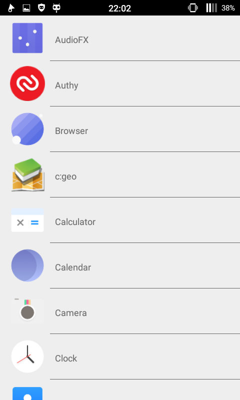

#Android-Practice
Android apps made while learning Android dev. All apps except the first one were practice from [Android Programming: The Big Nerd Ranch Guide](https://www.bignerdranch.com/we-write/android-programming/). 

I started with the first version and I'm now reading the second version, planning to update everything to the latest SDK and features.

##The apps
###GeoQuizz
Right Answer | Cheating | Answered after cheating
:-:|:-:|:-:
||

###CriminalIntent
First screen | Creating a crime | First screen with one crime
:-:|:-:|:-:
||

###HelloMoon
Not playing | Playing
:-:|:-:
|

###Launcher

###Remote
First screen | After entering a number
:-:|:-:
|

###PhotoGallery
Recent pics | Details
:-:|:-:
|

(All the pics used in those screenshot are owned by the users who took them and are in no way mines.)

###DragAndDraw
